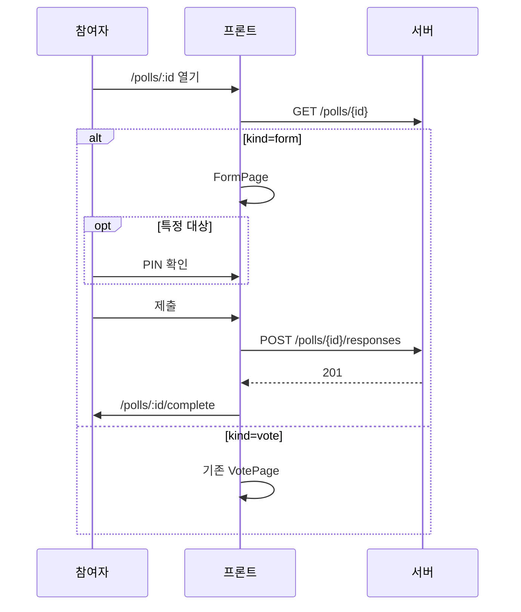
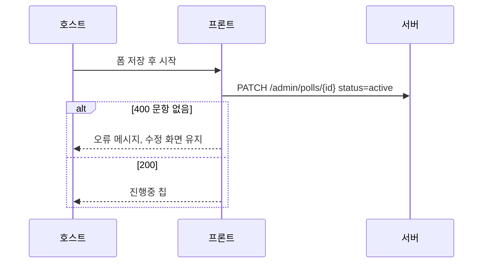

<!-- AI 지시문: 기능요청서 + 인터페이스 정의를 입력으로 작성하라. 3페이지 상한. 구현 코드를 쓰지 말고 구현이 따라갈 결정만 써라. 이 문서가 바이브코딩의 입력이다. -->
# 기술스펙_인터뷰폼

- 기능요청: [#1](https://github.com/MEV-SW/vote-web/issues/1) / 인터페이스 정의: [화면정의서_인터뷰폼](https://github.com/MEV-SW/vote-web/blob/main/docs/기능/1-인터뷰폼/화면정의서_인터뷰폼.md)
- 작성: 채윤성 / 승인: 없음 (기술스펙은 본인 머지)

## 변경 범위
- 목록·만들기·수정·응답·완료·공개결과·운영결과에 폼 분기. `kind=form`이면 순위 UI 대신 문항 UI.
- 새 라우트는 만들지 않는다. `/polls/:pollId`가 `kind`를 보고 `FormPage`를 그린다.
- 회사 로그인·소유권 필터는 이 카드에서 바꾸지 않는다. 특정 대상 PIN 게이트는 기존 `VoteVerifyGate`를 재사용한다.

## DB 스키마 변경분
- 없음

## 핵심 흐름 (시퀀스 1-2개)
- 만들기는 `CreatePollModal`에서 종류=폼, 후보는 보내지 않음, `identity_mode=identified`.
- 수정은 `QuestionEditor`가 문항·보기 API를 호출. 시작은 문항 1개 이상.
- 응답은 fingerprint를 붙인다. 특정+PIN이면 게이트 통과 후 `voter_token`. 이미 제출이면 완료/안내로 보낸다.
- 공개 결과는 객관식·척도만. 운영 결과는 개별 응답·CSV.

## 외부 의존성
- [vote-server API스펙_인터뷰폼](https://github.com/MEV-SW/vote-server/blob/main/docs/기능/1-인터뷰폼/API스펙_인터뷰폼.md). Vite `/api` 프록시. 새 npm 패키지 없음.
- 쓸 컴포넌트는 화면정의서와 같다. `FormPage` / `QuestionEditor` / `FormResultsView`만 이 카드에서 추가한다.

## flag
- 없음. OFF 동작 없음.
