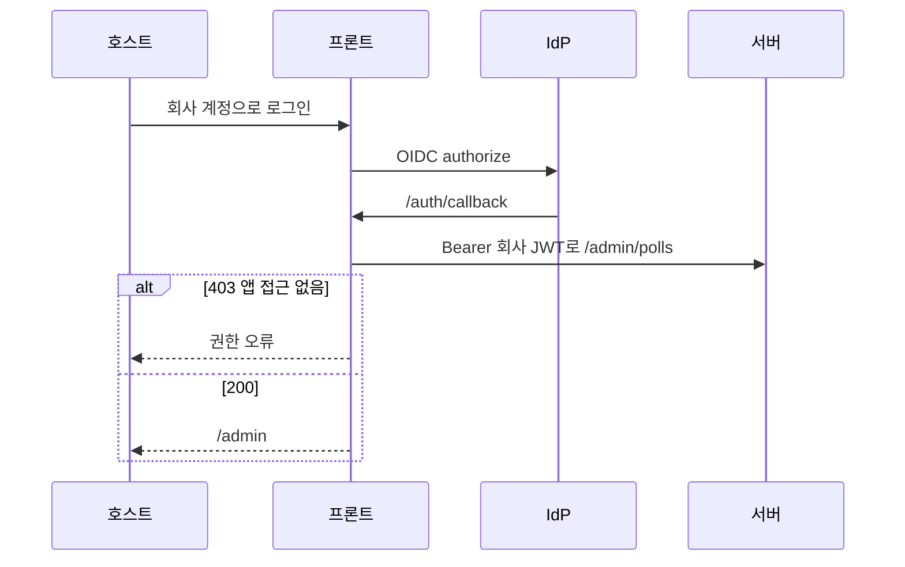
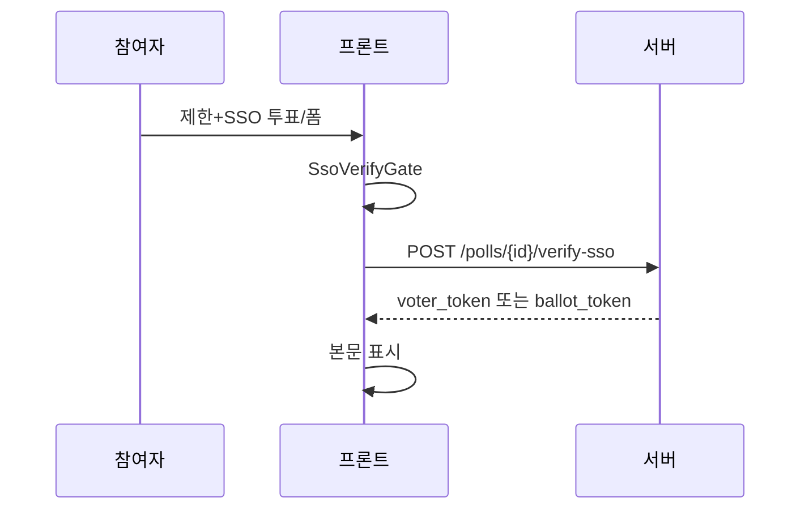

<!-- AI 지시문: 기능요청서 + 인터페이스 정의를 입력으로 작성하라. 3페이지 상한. 구현 코드를 쓰지 말고 구현이 따라갈 결정만 써라. 이 문서가 바이브코딩의 입력이다. -->
# 기술스펙_회사로그인SSO

- 기능요청: [#2](https://github.com/MEV-SW/vote-web/issues/2) / 인터페이스 정의: [화면정의서_회사로그인SSO](https://github.com/MEV-SW/vote-web/blob/main/docs/기능/2-회사로그인/화면정의서_회사로그인SSO.md)
- 작성: 채윤성 / 승인: 없음 (기술스펙은 본인 머지)

## 변경 범위
- `/admin/login`에 회사 계정 버튼. `/auth/callback`. 제한 참여의 `SsoVerifyGate`.
- `oidc-client-ts` UserManager. 만들기 화면 토큰과 참여용 토큰을 구분해 저장한다.
- 소유권 필터 UI는 [#3](https://github.com/MEV-SW/vote-web/issues/3). Keycloak 역할로 전체 투표를 관리하는 UI는 만들지 않는다.

## DB 스키마 변경분
- 없음

## 핵심 흐름 (시퀀스 1-2개)

## 외부 의존성
- [vote-server API스펙_Keycloak앱접근](https://github.com/MEV-SW/vote-server/blob/main/docs/기능/3-Keycloak/API스펙_Keycloak앱접근.md). `oidc-client-ts`. Vite `/auth/callback` 리다이렉트 URI.

## flag
- 없음. `auth/config`의 `oidc_enabled`가 false면 회사 버튼을 숨긴다.
