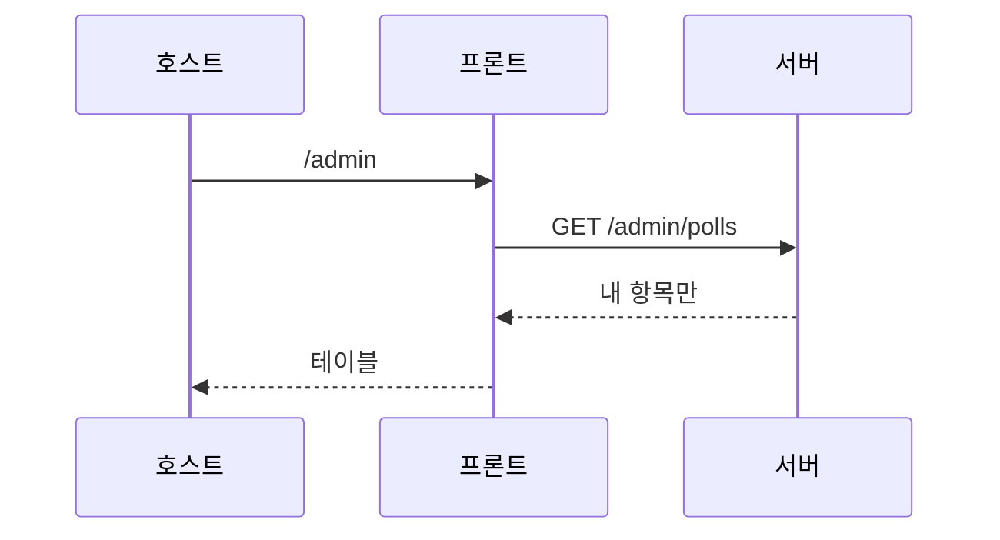
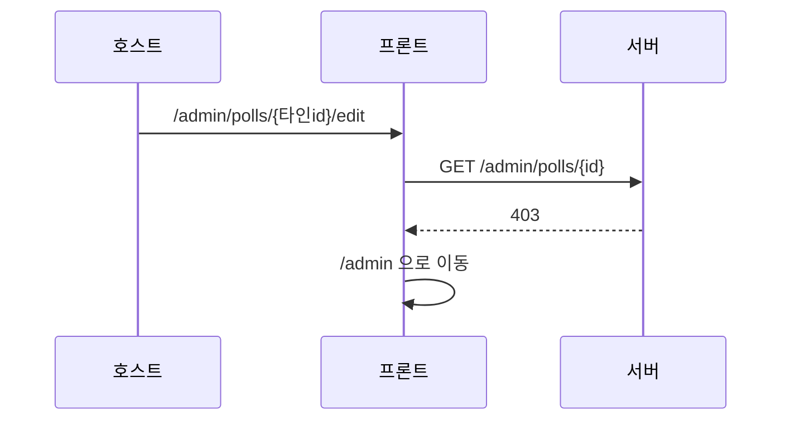

<!-- AI 지시문: 기능요청서 + 인터페이스 정의를 입력으로 작성하라. 3페이지 상한. 구현 코드를 쓰지 말고 구현이 따라갈 결정만 써라. 이 문서가 바이브코딩의 입력이다. -->
# 기술스펙_내투표관리

- 기능요청: [#3](https://github.com/MEV-SW/vote-web/issues/3) / 인터페이스 정의: [화면정의서_내투표관리](https://github.com/MEV-SW/vote-web/blob/main/docs/기능/3-내투표/화면정의서_내투표관리.md)
- 작성: 채윤성 / 승인: 없음 (기술스펙은 본인 머지)

## 변경 범위
- 관리 목록 카피: 내가 만든 항목. 서버가 이미 필터한다.
- 수정/결과에서 403이면 `/admin`으로 보낸다. 전역 대시보드 없음.
- 로그인·SSO는 [#2](https://github.com/MEV-SW/vote-web/issues/2).

## DB 스키마 변경분
- 없음

## 핵심 흐름 (시퀀스 1-2개)

## 외부 의존성
- [vote-server API스펙_생성자소유권](https://github.com/MEV-SW/vote-server/blob/main/docs/기능/4-소유권/API스펙_생성자소유권.md). 새 npm 패키지 없음.

## flag
- 없음. OFF 동작 없음.
